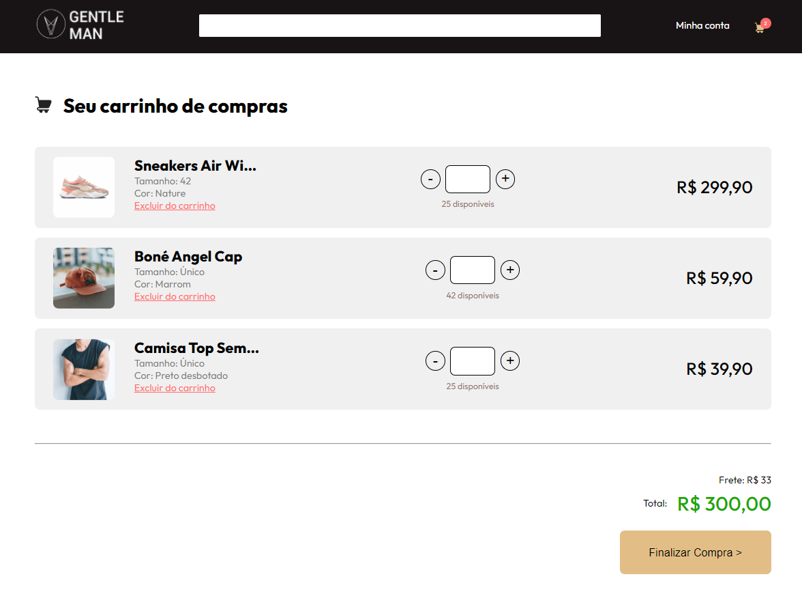

# Cubos XP - 06/2023

Nesse repositório você vai encontrar o código desenvolvido no mini-curso da Cubos Academy realizado nos dias 19 e 20/06/2023.

# Tecnologias Utilizadas
- HTML5
- CSS3

# Pontos que ainda precisam de atenção
- Responsividade
- Adicionar o Javascript para tornar a página funcional